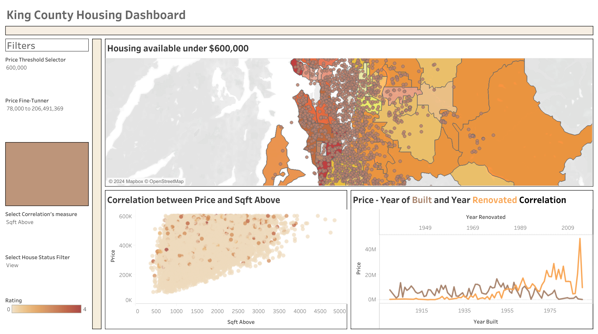

# Finding suitable housing for a client
## Project - Data Analysis

This project is centered around exploratory data analysis techniques and presentation of results to a client.  

# The data  

Th data used will be the King County Housing Data: This dataset contains information about home sales in King County (USA).
- I've obtained the data from the eda schema of Neue fische's database.  
- This data can be also found in www.kaggle.com
More information about the data can be found in the **additional_info** document.

# The Tasks

1. I will choose one client (at least one per Notebook) and make the analysis acording their characteristics. 

2. Through EDA/statistical analysis I will up with some insights regarding the overall data.

3. In addition I also will come up with at least 3 recommendations for my client / clients.

# Setup and requirements  

This information can be ound in the **additional_info** document.

*See on Tableau Public:* [Dashboard 1](https://public.tableau.com/shared/BR6MDTH3M?:display_count=n&:origin=viz_share_link)  
[Dashboard 2](https://public.tableau.com/shared/8NHW3K4DP?:display_count=n&:origin=viz_share_link)
